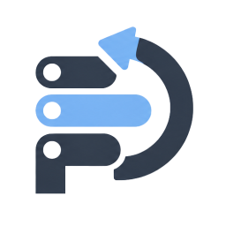

<p align="center"></p>

# PIDRA

PIDRA is a small Linux TUI for answering two questions:

1. Which desktop app is using all that memory?
2. What actually happened after I tried to stop it?

The first screen stays focused on GUI applications instead of dumping every
process on the machine. Press `V` for a separate developer/server list. That
list only accepts current-user processes with a TCP listening socket or an
explicit dev-server command; protected session and system targets stay out.

Every action sits in one bar below the list and applies to the selected
process, so a click can only select a row and never stop an application.
PIDRA does not set foreground or background colors: hierarchy comes from
weight, underline, dim text and reverse video, which keeps it readable in any
terminal theme.

```text
PIDRA   Apps 6 / Dev 2                                  CPU 18% ━····  RAM 35% ━━···

PROCESS NAME                                         PID      MEM P/R↓  REL. MEM

spotify                                             2031      1.2 GB P  ━━━━━━━━━━
zen                                               128870      998 MB R  ━━━━━━━━··

spotify →  [R] Restart  [S] Stop  [D] Details
Showing 6 GUI processes from 412 scanned processes
Enter use   / Search   O Sort   V Apps/Dev   ? Help   Q Quit
```

`P` means complete proportional set size (PSS); `R` means PIDRA fell back to
the complete tree's RSS because at least one PSS value was unavailable. The
`REL. MEM` bars compare each app with the largest app in the current list, and
`↓` marks the active sort column. The line above the footer reports what PIDRA
last did, for example a sorted column, a queued action or a blocked one.
`REL. MEM` only appears from 64 terminal columns on.

## Install

You need a current Rust toolchain and Linux.

```bash
git clone https://github.com/mikaeww/PIDRA.git
cd PIDRA
cargo install --path . --locked
```

Then start it with:

```bash
pidra
```

If Cargo's bin directory is not in your `PATH`, either add `~/.cargo/bin` or
link the binary into `~/.local/bin`.

## NixOS Flake

Add PIDRA to the `inputs` of the flake that manages your Home Manager
configuration:

```nix
inputs.pidra.url = "github:mikaeww/PIDRA";
```

Add the Home Manager module to a module file such as `apps/pidra/default.nix`:

```nix
{ inputs, ... }:

{
  imports = [
    inputs.pidra.homeManagerModules.default
  ];

  programs.pidra.enable = true;
}
```

If you prefer the package directly instead of the Home Manager module, add it
to `home.packages`:

```nix
home.packages = [
  inputs.pidra.packages.${pkgs.system}.pidra
];
```

The flake also exports `nixosModules.default` and `overlays.default`.

## Controls

### Process table

| Key | What it does |
| --- | --- |
| `↑` / `↓` | Select a process |
| `←` / `→` | Move the focus between Restart, Stop and Details |
| `Enter` | Run the focused action |
| `R`, `S`, `D` | Focus Restart, Stop or Details |
| `/` | Search by name or PID |
| `Esc` | Leave the developer/server list |
| `V` | Toggle the developer/server process list |
| `O` | Cycle sorting by memory, CPU, name, PID and write rate |
| `H` | Show the bounded session or optional persistent action history |
| `?` | Open help |
| `Q` | Quit |

While searching, type to filter, `Backspace` deletes a character and `Enter`
or `Esc` closes the search. `Ctrl+C` quits from any view.

### Details

| Key | What it does |
| --- | --- |
| `↑` / `↓` | Select a tree node |
| `←` / `→`, `Enter` | Collapse or expand a tree node |
| `Tab` | Switch between Overview and Technical |
| `Page Up` / `Page Down` | Scroll the information pane |
| `Home` / `End` | Jump to the top or the bottom |
| `R` | Open the restart confirmation |
| `F` | Freeze or resume the selected process |
| `T` | Send SIGTERM to the selected process |
| `Shift+K` | Open the Force Stop confirmation |
| `Esc` | Back to the process table |
| `H`, `?`, `Q` | History, help, quit |

Force Stop and Restart always ask again first; `Enter` or `Y` confirms, `Esc`
or `N` cancels. Both dialogs stay scrollable at narrow sizes.

Clicking a table row selects a process. In the action bar, clicking an
unfocused action focuses it and clicking the focused action runs it, exactly
like `Enter`. Mouse capture can be disabled with `--no-mouse`, which keeps the
terminal's own text selection available.

## What Details shows

**Overview** keeps the everyday answer together: application memory, CPU and
process count, a 30-second trend, the expandable process tree of the
application and a plain-language close risk.

**Technical** holds the evidence: PID, UID, start time, executable, masked
command line, working directory and cgroup; RSS, PSS, threads and read/write
rates per process and for the whole application; and how the process was
classified plus why an action is available or blocked.

Both pages refer to the selected child process; actions only ever affect that
process, never the whole tree.

## Safety

- **Stop is SIGTERM.** PIDRA never turns it into SIGKILL behind your back.
- **Force Stop is explicit.** It only exists in Details and always asks again.
- Every signal checks both the PID and its `/proc` start time. A reused PID is
  rejected.
- PID 1, PIDRA itself, its parent chain and essential desktop-session processes
  are blocked.
- Command lines are masked and the masking cannot be turned off in this
  release.
- The developer/server list is current-user only. A process needs a real TCP
  listener or a recognized dev command, and protected targets are filtered a
  second time by the normal termination analysis.
- A green-looking risk assessment is not a promise. An application can still
  lose unsaved work.
- Restart uses a real systemd user service when one exists. Transient app
  scopes cannot be started again by systemd, so PIDRA falls back to a guarded
  direct restart only when it has an absolute executable and working directory.
- Hyprland and Sway window ownership is read from their native JSON interfaces.
  KDE Plasma and GNOME use conservative systemd application-scope evidence
  when no safe non-interactive compositor PID mapping is available.

Spotify and other Chromium/Electron apps often have many helper processes and
may handle SIGTERM themselves. If one stays alive, PIDRA reports **STILL
RUNNING**; it does not silently kill the remaining process tree.

## Options

```text
--no-mouse
--no-color
--ascii
--refresh <MILLISECONDS>
--pid <pid>
inspect --pid <pid> [--json]
```

`--refresh` accepts 100 to 60000 milliseconds and defaults to 1000. `--pid`
opens Details for that process instead of the process table. Command-line
flags override the configuration file.

`inspect` prints one process as a report or as versioned JSON (`schema_version`
1) without entering the TUI, raw terminal mode or any process control:

```bash
pidra inspect --pid 1234
pidra inspect --pid 1234 --json
```

## Configuration

Configuration is optional. PIDRA reads
`$XDG_CONFIG_HOME/pidra/config.toml` or `~/.config/pidra/config.toml` and
rejects unknown keys instead of ignoring them.

```toml
refresh_interval_ms = 1000
mouse = true
unicode = true
persistent_history = false
history_capacity = 100
```

| Key | Default | Effect |
| --- | --- | --- |
| `refresh_interval_ms` | `1000` | Scan and redraw interval, 100 to 60000 |
| `mouse` | `true` | Request terminal mouse capture |
| `unicode` | `true` | `false` switches to ASCII symbols |
| `color` | `"auto"` | `auto`, `always` or `never`; see the note below |
| `persistent_history` | `false` | Write the action history to disk |
| `history_capacity` | `100` | Remembered actions, 1 to 10000 |
| `confirm_force_stop` | `true` | Fixed safety invariant, cannot be disabled |
| `mask_command_secrets` | `true` | Fixed safety invariant, cannot be disabled |
| `show_kernel_threads` | `false` | Accepted but currently ignored by the scanner |

`color`, `--no-color` and the `NO_COLOR` environment variable are read but have
no visual effect, because PIDRA draws without colors at all.

## Action history and logs

With `persistent_history = true`, PIDRA writes bounded, versioned JSONL to
`$XDG_STATE_HOME/pidra/history.jsonl` or
`~/.local/state/pidra/history.jsonl`. Entries contain only the timestamp,
display name, PID/start time, action and result—never a command, executable
path or working directory. The default remains session-only.

Logs go to `$XDG_STATE_HOME/pidra/pidra.log` or
`~/.local/state/pidra/pidra.log`. They are useful when an app ignores a signal
or a restart source turns out to be unavailable.

## Building and testing

```bash
cargo fmt --check
cargo clippy --all-targets --all-features -- -D warnings
cargo test --all-targets --all-features
cargo build --release
```

The implementation rules are in [BUILDPLAN.md](BUILDPLAN.md), and the manual
terminal checks are in [docs/SMOKE_TESTS.md](docs/SMOKE_TESTS.md).

PIDRA currently targets Linux only. It is licensed under the MIT license, see
[LICENSE](LICENSE).
